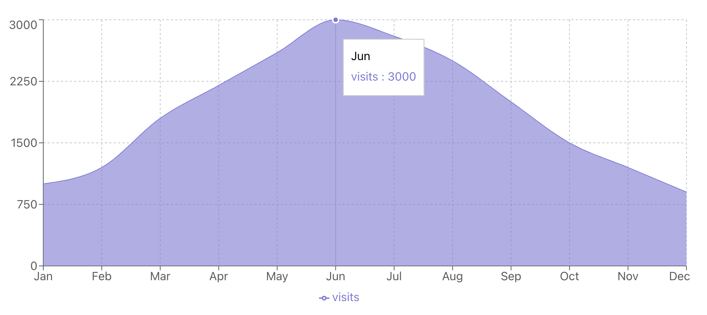

### Area Charts in React using Recharts library

An **Area Chart** is similar to a line chart, but the area between the line and the X-axis is filled with color, giving it a shaded look. This chart emphasizes the magnitude of values over time, making it useful for showing how values accumulate or change across a time period. The shaded area helps users quickly see how much value has built up over time.



### Key Characteristics

Some defining features of an area chart include:
- **Filled Area**: The space between the line and the X-axis is filled, highlighting the magnitude of change.
- **X and Y Axes**: Like line charts, the X-axis typically represents time, and the Y-axis represents the values.
- **Stacked Data**: Area charts can also stack multiple datasets on top of each other, allowing for easy comparisons of cumulative values.
- **Visual Impact**: The filled area helps convey not just the trend, but also the overall volume of the dataset.

### Common Use Cases

Area charts are frequently used in situations where both trends and volume matter. Some typical use cases include:
- **Cumulative Metrics**: Tracking total sales, revenue, or profit over time.
- **Website Traffic**: Monitoring the number of visitors, page views, or session duration over time.
- **Stock Prices**: Visualizing the value of an asset over time, with the shaded area showing overall growth.
- **Weather Data**: Plotting temperature or rainfall over time.

### Data Structure

Similar to line charts, area charts in Recharts use an array of objects as the data source. Each object represents a data point, with keys corresponding to values on the X and Y axes.

For example, if you’re tracking monthly website visits, the data might look like this:

```js
const data = [
  { month: 'Jan', visits: 1000 },
  { month: 'Feb', visits: 1200 },
  { month: 'Mar', visits: 1800 },
  { month: 'Apr', visits: 2200 },
  { month: 'May', visits: 2600 },
  { month: 'Jun', visits: 3000 },
  { month: 'Jul', visits: 2800 },
  { month: 'Aug', visits: 2500 },
  { month: 'Sep', visits: 2000 },
  { month: 'Oct', visits: 1500 },
  { month: 'Nov', visits: 1200 },
  { month: 'Dec', visits: 900 },
];
```

### Example: Visualizing Monthly Website Visits

Let’s create an area chart to visualize website visits over several months using Recharts.

#### Code Example:

```jsx
import React from 'react';
import { AreaChart, Area, XAxis, YAxis, CartesianGrid, Tooltip, ResponsiveContainer } from 'recharts';

const data = [
  { month: 'Jan', visits: 1000 },
  { month: 'Feb', visits: 1200 },
  { month: 'Mar', visits: 1800 },
  { month: 'Apr', visits: 2200 },
  { month: 'May', visits: 2600 },
  { month: 'Jun', visits: 3000 },
  { month: 'Jul', visits: 2800 },
  { month: 'Aug', visits: 2500 },
  { month: 'Sep', visits: 2000 },
  { month: 'Oct', visits: 1500 },
  { month: 'Nov', visits: 1200 },
  { month: 'Dec', visits: 900 },
];

function MonthlyVisitsChart() {
  return (
    <ResponsiveContainer width="100%" height={400}>
      <AreaChart data={data}>
        <CartesianGrid strokeDasharray="3 3" />
        <XAxis dataKey="month" />
        <YAxis />
        <Tooltip />
        <Area type="monotone" dataKey="visits" stroke="#8884d8" fill="#8884d8" />
      </AreaChart>
    </ResponsiveContainer>
  );
}

export default MonthlyVisitsChart;
```

### Explanation:

- **`AreaChart`**: This is the main component that wraps all elements of the chart.
- **`Area`**: The `Area` component draws the shaded area between the line and the X-axis. The `dataKey="visits"` tells the chart to use the `visits` field in the data. The `stroke` attribute defines the color of the line, and the `fill` attribute fills the area under the line.
- **`XAxis` and `YAxis`**: These define the axes. The `XAxis` is tied to the `month` field, while the `YAxis` is determined by the values in `visits`.
- **`CartesianGrid`**: Adds a grid for easier reading.
- **`Tooltip`**: Displays information when hovering over different areas of the chart.

#### Output:
The above code generates an area chart that visualizes website visits across different months, with a filled area under the line to emphasize the volume of visits.

### Conclusion

Area charts are an excellent choice when you want to visualize trends over time and also highlight the magnitude of values. The filled area under the line adds visual weight, making it easy to convey how much data has accumulated or changed. With Recharts, creating an area chart is straightforward, and you can easily customize it to suit your needs.
