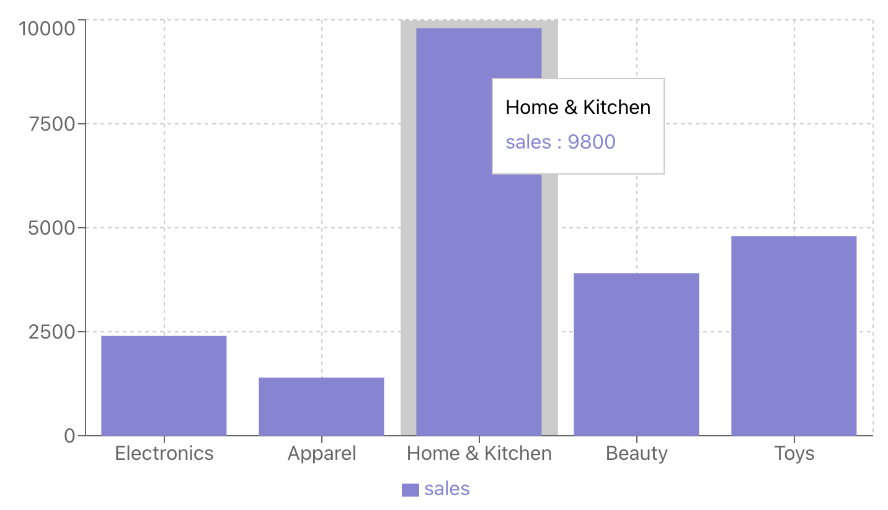

### Bar Charts in React using Recharts Library

A **Bar Chart** is a common type of data visualization that displays categorical data using rectangular bars. Each bar represents a category, and its height (or length) is proportional to the value of that category. Bar charts are highly effective for comparing quantities across different categories, making it easy to see differences at a glance.



### Key Characteristics

Some defining features of a bar chart include:
- **Rectangular Bars**: Each category is represented by a bar, whose length is proportional to the value.
- **Horizontal or Vertical Layout**: Bars can be displayed either horizontally or vertically.
- **Categorical Data**: Bar charts are best suited for data that is divided into distinct categories, such as products, regions, or departments.
- **Easy Comparison**: The visual nature of bar charts allows for quick comparison of values across different categories.

### Common Use Cases

Bar charts are widely used to compare quantities across different categories. Some typical use cases include:
- **Sales Data**: Comparing product sales across different months or regions.
- **Population Data**: Displaying the population of various cities, regions, or countries.
- **Survey Results**: Visualizing how many respondents selected each option in a survey.
- **Budget Allocation**: Illustrating the distribution of a budget across different departments or expenses.

### Data Structure

In Recharts, a bar chart uses an array of objects as the data source, where each object represents a category. Each object typically contains keys corresponding to the category name and its value.

For example, if you’re visualizing a company’s budget allocation, the data might look like this:

```js
const data = [
  { name: 'Salaries', value: 50 },
  { name: 'Marketing', value: 20 },
  { name: 'Operations', value: 15 },
  { name: 'R&D', value: 10 },
  { name: 'Miscellaneous', value: 5 },
];
```

### Example: Visualizing Sales Data

Let’s create a bar chart to visualize sales data for different product categories using Recharts.

#### Code Example:

```jsx
import React from 'react';
import { BarChart, Bar, XAxis, YAxis, CartesianGrid, Tooltip, ResponsiveContainer } from 'recharts';

const data = [
  { name: 'Electronics', sales: 2400 },
  { name: 'Apparel', sales: 1398 },
  { name: 'Home & Kitchen', sales: 9800 },
  { name: 'Beauty', sales: 3908 },
  { name: 'Toys', sales: 4800 },
];

function SalesBarChart() {
  return (
    <ResponsiveContainer width="100%" height={400}>
      <BarChart data={data}>
        <CartesianGrid strokeDasharray="3 3" />
        <XAxis dataKey="name" />
        <YAxis />
        <Tooltip />
        <Bar dataKey="sales" fill="#8884d8" />
      </BarChart>
    </ResponsiveContainer>
  );
}

export default SalesBarChart;
```

### Explanation:

- **`BarChart`**: This component contains the overall chart.
- **`Bar`**: The `Bar` component represents the individual bars in the chart. The `dataKey="sales"` tells the chart to use the `sales` field in the data for the height of the bars.
- **`XAxis` and `YAxis`**: These define the X and Y axes. The `XAxis` is tied to the `name` field, representing the product categories, while the `YAxis` represents the sales numbers.
- **`CartesianGrid`**: Adds a grid to make the chart easier to read.
- **`Tooltip`**: Displays additional information when hovering over a bar.
- **`ResponsiveContainer`**: Ensures the chart adapts to the available screen size.

#### Output:
This code generates a bar chart that displays sales data across several product categories, with each bar representing the sales for that category. You can hover over a bar to see the exact sales numbers in the tooltip.

### Conclusion

Bar charts are a powerful way to compare values across different categories. Their simple, rectangular bars make them easy to understand and effective for displaying categorical data. Using Recharts, you can quickly create customizable bar charts to visualize data in a way that suits your needs. Whether you're comparing sales, survey responses, or any other categorical data, bar charts are a great tool for your data visualization toolkit.