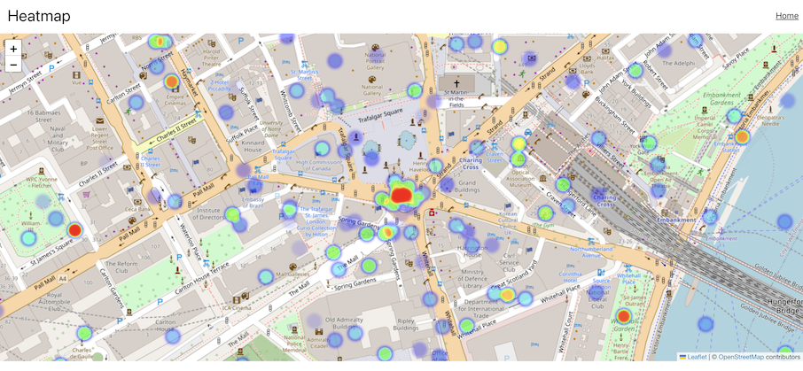

### Heatmaps in React

A **heatmap** is a data visualization technique used to represent the intensity of data points on a map or a grid. The intensity of each point is shown using varying colors, typically transitioning from cooler colors (e.g., blue) for lower values to warmer colors (e.g., red) for higher values. Heatmaps make it easy to identify patterns, trends, and outliers in geographic or grid-based data.



### Key Characteristics of a Heatmap:
- **Color intensity**: Indicates the magnitude or frequency of data points.
- **Geospatial context**: Used to visualize data over geographical areas.
- **Radius and blur**: Heatmaps often feature radius and blur settings to control the spread of intensity.

### Common Use Cases for Heatmaps

1. **Visualizing Population Density**: Heatmaps can show areas with a high concentration of people or activities in urban planning.
2. **Real Estate Analysis**: Realtors and property analysts use heatmaps to visualize housing market trends.
3. **Crime Analysis**: Law enforcement agencies use heatmaps to identify crime hotspots in cities.
4. **Website Click Tracking**: On websites, heatmaps show where users are clicking or focusing their attention.
5. **Weather Data**: Meteorologists use heatmaps to show temperature or precipitation patterns across a region.
6. **Event Revenue Analysis**: Businesses use heatmaps to track revenue generated in specific locations over time.

### Heatmap Data Structure

The data structure for a heatmap typically consists of an array of data points, each represented by a set of coordinates (latitude and longitude) and an optional intensity value. The intensity indicates the "weight" or "importance" of that particular point, which determines how much it influences the surrounding area on the map.

#### Basic Data Structure Example:

```javascript
const heatmapData = [
  [latitude1, longitude1, intensity1],
  [latitude2, longitude2, intensity2],
  [latitude3, longitude3, intensity3],
];
```

#### Components of a Heatmap Data Point:
- **Latitude (number)**: The vertical position of the point on the Earth's surface.
- **Longitude (number)**: The horizontal position of the point on the Earth's surface.
- **Intensity (optional, number)**: A value between 0 and 1 representing the intensity of the data point. If omitted, a default intensity is usually applied.

#### Example:
```javascript
const heatmapData = [
  [51.5074, -0.1278, 0.8], // Central London
  [51.515, -0.09, 0.6],    // North London
  [51.503, -0.12, 0.7],    // South London
];
```

In this example, the first data point represents Central London with a high intensity of 0.8, while the other points have lower intensities. The higher the intensity, the more prominently that point will appear on the heatmap.

### NPM Packages for Heatmaps in React

```bash
npm install react-leaflet leaflet leaflet.heat
```

### Implementation File
[React Heatmap Component](src/components/heatmap.jsx)

### Customization Options

- **Radius**: Controls how far the intensity of a point spreads out from its location. Adjust this depending on your use case.
- **Blur**: Adds a blur effect to smooth the transitions between different intensity values.

---

### Conclusion
Heatmaps are a powerful tool for visualizing geographic data. By integrating heatmaps into your React application using **react-leaflet** and **leaflet.heat**, you can create visually compelling data representations that highlight trends and insights for your data.


