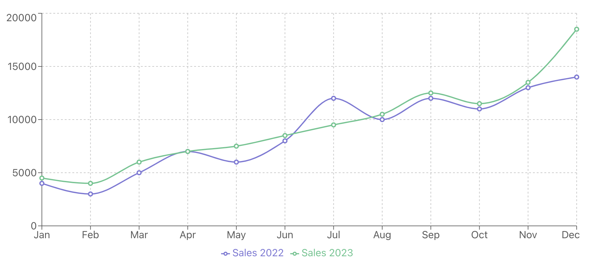

### Line Charts in React

A **Line Chart** is a type of chart that displays information as a series of data points called "markers" connected by straight line segments. It's used to show trends over a specific time period, making it ideal for displaying time series data. A typical example would be showing the growth of sales month-over-month, or tracking website traffic over time.



### Key Characteristics

Here are some key features of a line chart:
- **Continuous Data**: Line charts are best used for continuous data, where you want to track changes over time.
- **Connected Points**: The data points (markers) are connected by straight lines, making it easy to see trends.
- **X and Y Axes**: The X-axis typically represents time (like days, months, or years), while the Y-axis represents the value you’re measuring (like sales, temperature, or website visits).
- **Multiple Lines**: You can plot multiple lines on a single chart to compare different datasets.

### Common Use Cases

Line charts are commonly used in various fields to visualize trends, including:
- **Business**: Tracking sales, profit, or revenue over time.
- **Website Analytics**: Monitoring website traffic, page views, or user engagement over a specific period.
- **Finance**: Displaying stock prices or financial metrics like revenue growth.
- **Health**: Tracking the number of daily steps or weight loss over a period.

### Data Structure

In Recharts, the data for a line chart is usually an array of objects, where each object represents a data point. Each key in the object corresponds to a value for the X-axis, Y-axis, or other dimensions like tooltips and labels.

For example, if you're tracking monthly sales, the data structure might look like this:

```js
const data = [
  { month: 'Jan', sales: 4000 },
  { month: 'Feb', sales: 3000 },
  { month: 'Mar', sales: 5000 },
  { month: 'Apr', sales: 7000 },
  { month: 'May', sales: 6000 },
];
```

### Example: Visualizing Monthly Sales

Let’s create a simple line chart to visualize sales data for a company from January to May using Recharts.

#### Code Example:

```jsx
import React from 'react';
import { LineChart, Line, XAxis, YAxis, CartesianGrid, Tooltip, Legend, ResponsiveContainer } from 'recharts';

const data = [
  { month: 'Jan', sales: 4000 },
  { month: 'Feb', sales: 3000 },
  { month: 'Mar', sales: 5000 },
  { month: 'Apr', sales: 7000 },
  { month: 'May', sales: 6000 },
];

function MonthlySalesChart() {
  return (
    <ResponsiveContainer width="100%" height={400}>
      <LineChart data={data}>
        <CartesianGrid strokeDasharray="3 3" />
        <XAxis dataKey="month" />
        <YAxis />
        <Tooltip />
        <Legend />
        <Line type="monotone" dataKey="sales" stroke="#8884d8" strokeWidth={2} />
      </LineChart>
    </ResponsiveContainer>
  );
}

export default MonthlySalesChart;
```

### Explanation:

- **`LineChart`**: This is the main component that wraps all the elements of the chart.
- **`Line`**: The `Line` component is used to plot the sales data. The `dataKey="sales"` tells the chart to use the `sales` field in the data.
- **`XAxis` and `YAxis`**: These define the axes. The `XAxis` is tied to the `month` field, while the `YAxis` automatically adjusts based on the `sales` values.
- **`CartesianGrid`**: Adds a grid to the chart to make it easier to read.
- **`Tooltip`**: Displays the values when you hover over a point on the chart.
- **`Legend`**: Adds a legend to label the lines (useful when there are multiple lines).

#### Output:
The above code will generate a responsive line chart where you can visually track the sales data across different months. When you hover over a point, the tooltip will show the specific sales value for that month.

### Conclusion

Line charts are an excellent tool for tracking and visualizing trends over time. Whether you're monitoring monthly sales, website traffic, or any other metric, they provide a clear and intuitive way to understand changes and patterns. With Recharts, creating a line chart is simple and customizable, making it an excellent choice for React developers who want to integrate data visualization into their applications.

Feel free to experiment with more advanced features, such as customizing tooltips, adding multiple lines, or changing the chart’s style to fit your design!