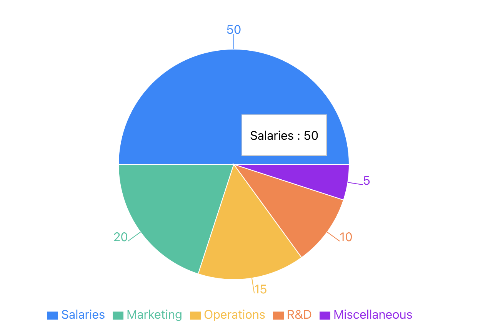

### Pie Charts in React using Recharts Library

A **Pie Chart** is a circular statistical graphic that is divided into slices to illustrate numerical proportions. Each slice represents a category of data and its size is proportional to the percentage of that category in the whole. Pie charts are excellent for showing relative sizes, such as how a particular segment compares to others.



### Key Characteristics

Some defining features of a pie chart include:
- **Circular Format**: The entire dataset is represented in a circle, with each segment representing a proportion of the whole.
- **Categorical Data**: Each slice is a category, and the size of the slice corresponds to the data value.
- **Percentages**: Pie charts typically display values as percentages of a whole, making it easy to compare segments.
- **Limited Segments**: Pie charts are most effective with a small number of categories to maintain clarity.

### Common Use Cases

Pie charts are commonly used to present the breakdown of a dataset into segments. Typical use cases include:
- **Market Share Distribution**: Showing the percentage of market share held by different companies or products.
- **Budget Allocation**: Illustrating how a budget is divided among various expenses.
- **Survey Results**: Presenting the percentage of responses in different categories (e.g., customer satisfaction levels).
- **Sales Data**: Visualizing the distribution of sales across different products or regions.

### Data Structure

In Recharts, a pie chart uses an array of objects as the data source, where each object represents a category. Each object should have a key representing the name of the category and a key for the value.

For example, if you are visualizing market share, the data might look like this:

```js
const data = [
  { name: 'Salaries', value: 50 },
  { name: 'Marketing', value: 20 },
  { name: 'Operations', value: 15 },
  { name: 'R&D', value: 10 },
  { name: 'Miscellaneous', value: 5 },
];
```

### Example: Visualizing Budget Allocation

Let’s create a pie chart to visualize budget allocation using Recharts.

#### Code Example:

```jsx
import React from 'react';
import { PieChart, Pie, Tooltip, Cell, ResponsiveContainer } from 'recharts';

const data = [
  { name: 'Salaries', value: 50 },
  { name: 'Marketing', value: 20 },
  { name: 'Operations', value: 15 },
  { name: 'R&D', value: 10 },
  { name: 'Miscellaneous', value: 5 },
];

const COLORS = ['#0088FE', '#00C49F', '#FFBB28', '#FF8042', '#A020F0'];

function BudgetAllocationChart() {
  return (
    <ResponsiveContainer width="100%" height={400}>
      <PieChart>
        <Pie
          data={data}
          dataKey="value"
          nameKey="name"
          cx="50%"
          cy="50%"
          outerRadius={150}
          fill="#8884d8"
          label
        >
          {data.map((entry, index) => (
            <Cell key={`cell-${index}`} fill={COLORS[index % COLORS.length]} />
          ))}
        </Pie>
        <Tooltip />
      </PieChart>
    </ResponsiveContainer>
  );
}

export default BudgetAllocationChart;
```

### Explanation:

- **`PieChart`**: This is the main component that holds the pie chart.
- **`Pie`**: The `Pie` component represents the actual pie slices. The `dataKey="value"` tells it to use the `value` field in the data for the size of the slices. The `nameKey="name"` is used to label the slices.
- **`Cell`**: The `Cell` component is used to apply different colors to the slices.
- **`Tooltip`**: Adds hover functionality to show details about each segment.
- **`ResponsiveContainer`**: Ensures the chart is responsive and adapts to different screen sizes.

#### Output:
The code above creates a pie chart that shows the budget allocation across various categories, with different colors for each slice and a tooltip that displays more information when you hover over a slice.

### Conclusion
Pie charts are an effective way to visualize proportions in a dataset, showing how individual parts compare to the whole. They are easy to interpret and highly customizable in Recharts, allowing you to adjust the appearance, colors, and labels based on your needs.
