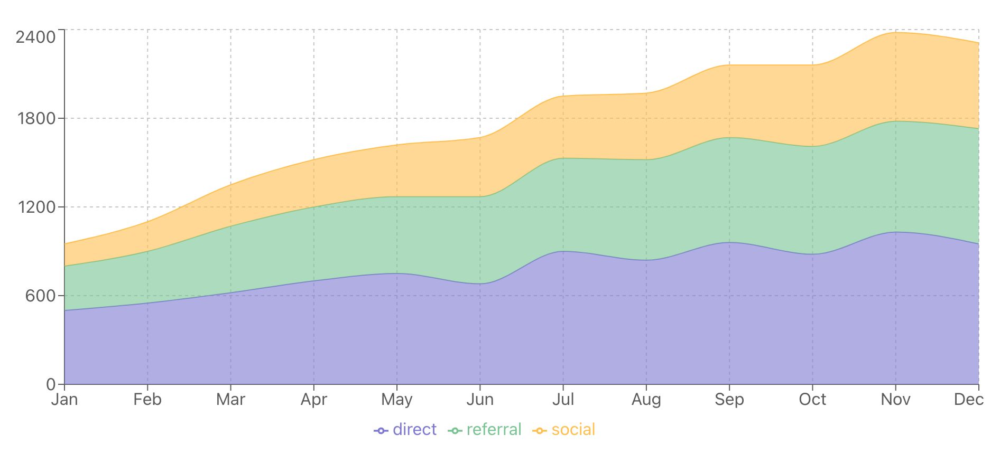

### Stacked Area Charts in React using Recharts library

A **Stacked Area Chart** is an extension of the basic area chart, where multiple data series are stacked on top of each other. This allows you to compare not only the individual data trends but also the cumulative value of all data series. The stacked structure helps visualize the total values as well as how much each category contributes to the total at any point in time.



### Key Characteristics

Here are the key characteristics of a stacked area chart:
- **Stacked Areas**: Each dataset is stacked on top of the previous one, allowing for easy comparisons of multiple datasets.
- **Cumulative Data**: The Y-axis shows the total value for each category, which helps in understanding how individual components contribute to the overall sum.
- **Visual Clarity**: By stacking the data series, it becomes easier to see both individual and collective trends over time.
- **Fill Color**: Different colors are used for each series to distinguish between categories clearly.

### Common Use Cases

Stacked area charts are commonly used when you want to visualize the contribution of different categories to a total. Some examples include:
- **Sales Performance**: Visualizing the contribution of different product categories to total sales over time.
- **Web Traffic Sources**: Displaying how various traffic sources (social media, direct, referral) contribute to overall website traffic.
- **Energy Consumption**: Showing how different energy sources contribute to total energy consumption.
- **Revenue Streams**: Tracking how different revenue sources (product sales, subscriptions, services) add up to overall company revenue.

### Data Structure

Like other area charts, stacked area charts use an array of objects as the data source. Each object represents a data point, with keys corresponding to the X and Y values, as well as categories for stacking.

Here's an example dataset that tracks website traffic from different sources over several months:

```js
const data = [
  { month: 'Jan', direct: 400, referral: 300, social: 200 },
  { month: 'Feb', direct: 500, referral: 400, social: 300 },
  { month: 'Mar', direct: 600, referral: 500, social: 400 },
  { month: 'Apr', direct: 700, referral: 600, social: 500 },
  { month: 'May', direct: 800, referral: 700, social: 600 },
];
```

### Example: Visualizing Website Traffic Sources

Let’s create a stacked area chart to visualize how website traffic from different sources (direct, referral, social) changes over time.

#### Code Example:

```jsx
import React from 'react';
import { AreaChart, Area, XAxis, YAxis, CartesianGrid, Tooltip, ResponsiveContainer } from 'recharts';

const data = [
  { month: 'Jan', direct: 400, referral: 300, social: 200 },
  { month: 'Feb', direct: 500, referral: 400, social: 300 },
  { month: 'Mar', direct: 600, referral: 500, social: 400 },
  { month: 'Apr', direct: 700, referral: 600, social: 500 },
  { month: 'May', direct: 800, referral: 700, social: 600 },
];

function StackedTrafficChart() {
  return (
    <ResponsiveContainer width="100%" height={400}>
      <AreaChart data={data}>
        <CartesianGrid strokeDasharray="3 3" />
        <XAxis dataKey="month" />
        <YAxis />
        <Tooltip />
        <Area type="monotone" dataKey="direct" stackId="1" stroke="#8884d8" fill="#8884d8" />
        <Area type="monotone" dataKey="referral" stackId="1" stroke="#82ca9d" fill="#82ca9d" />
        <Area type="monotone" dataKey="social" stackId="1" stroke="#ffc658" fill="#ffc658" />
      </AreaChart>
    </ResponsiveContainer>
  );
}

export default StackedTrafficChart;
```

### Explanation:

- **`stackId="1"`**: The `stackId` prop is what makes the areas stack on top of each other. All areas with the same `stackId` are stacked together.
- **`Area` Components**: Each `Area` represents a different traffic source (direct, referral, and social). The `dataKey` prop defines which data series to use, while the `stroke` and `fill` props define the line and fill colors.
- **Tooltip**: Shows detailed data values when hovering over a specific point on the chart.

#### Output:
The stacked area chart visualizes traffic sources over months, with each source represented by a different color. The chart stacks these areas to show how the total traffic is distributed across different categories.

### Conclusion

Stacked area charts are perfect for showing how individual components contribute to the overall total in a visually clear and structured way. They are great for comparing multiple categories over time and visualizing cumulative data. With Recharts, it's easy to implement and customize stacked area charts for your specific use case, allowing you to convey complex information in a simple and visually appealing way.